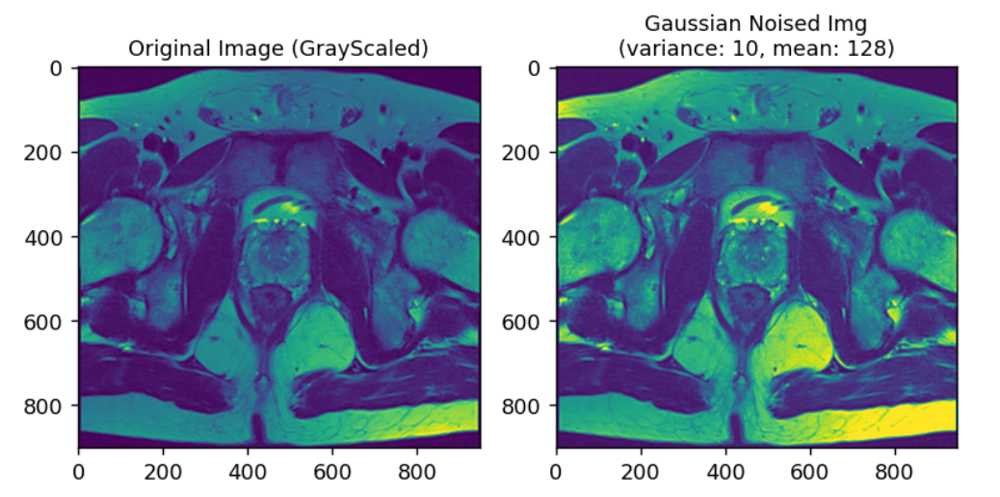
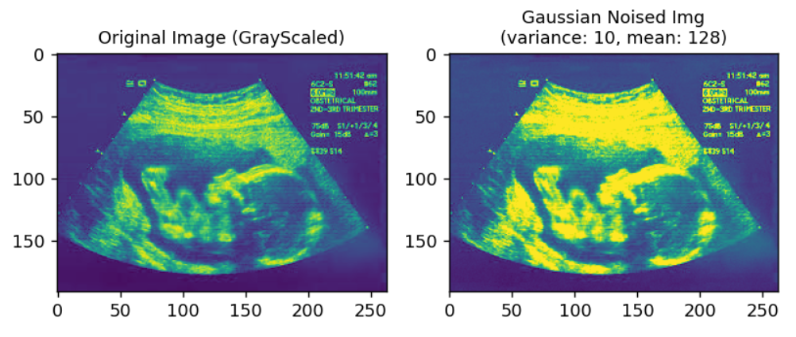
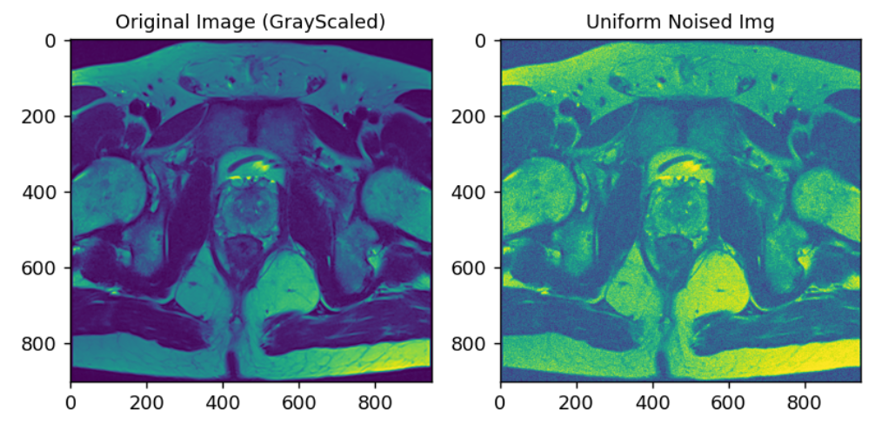
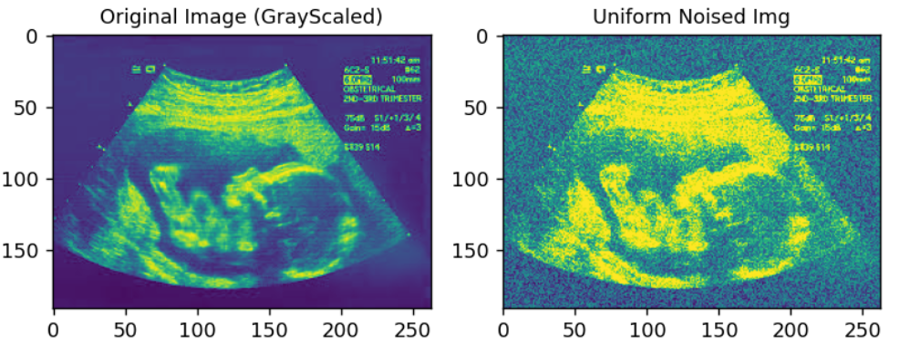
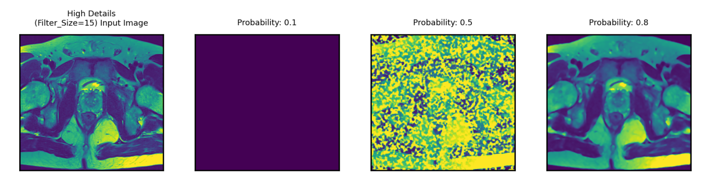
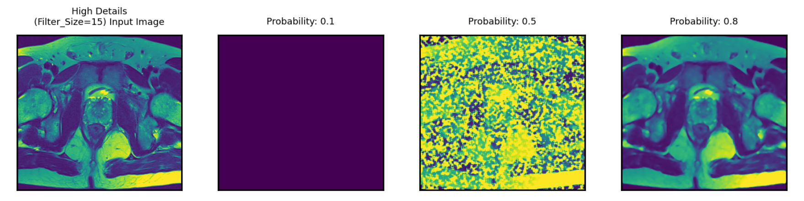

<div align="center">
  

  <h3 align="center">Edge Preserving Filters applied to High-Low Detailed Gaussian&Uniform Noised Images</h3>

  <p align="center">
    Edge-preserving smoothing or filtering is an image processing technique that smooths away noise or
textures while retaining sharp edges. Examples are the median, bilateral, guided, anisotropic diffusion,
and Kuwahara filters. In this repo, we're selecting <b>median</b> and <b>bilateral</b> filters to apply on 
<b>Gaussian and Uniform noised</b> high and low detailed images.
    <br />
  </p>
</div>


<!-- TABLE OF CONTENTS -->
<details>
  <summary>Table of Contents</summary>
  <ol>
    <li>
      <a href="#about-the-project">About The Project</a>
    </li>
    <li>
      <a href="#getting-started">Technologies Used</a>
      <ul>
        <li><a href="#prerequisites">Prerequisites</a></li>
      </ul>
    </li>
    <li><a href="#usage">Report</a></li>
    <li><a href="#license">License</a></li>
    <li><a href="#contact">Contact</a></li>
    <li><a href="#References">References</a></li>
  </ol>
</details>


<!-- ABOUT THE PROJECT -->
## About The Project
Edge-preserving smoothing or filtering is an image processing technique that smooths away noise or
textures while retaining sharp edges. Examples are the median, bilateral, guided, anisotropic diffusion,
and Kuwahara filters. In this repo, we're selecting <b>median</b> and <b>bilateral</b> filters to apply on 
<b>Gaussian and Uniform noised</b> high and low detailed images.

In this experiment, you will analyze and discuss the effectiveness of edge-preserving filters in some special
conditions.


<p align="right">(<a href="#readme-top">back to top</a>)</p>


### Technologies Used

* [Python](https://www.python.org/) (3.10)
* [OpenCV](https://pypi.org/project/opencv-python/) (opencv-python:4.7.0)
* [NumPy](https://numpy.org/) (1.23.5)
* [Matplotlib](https://matplotlib.org/) (3.7.0)

<p align="right">(<a href="#readme-top">back to top</a>)</p>


<!-- Prerequisites -->
### Prerequisites

Once you install the python packages given in requirements.txt, you're free to run/test whole notebook.
* pip
  ```sh
  pip install -r requirements.txt
  ```

## Report
### Introduction 

<p>I have applied median and bilateral filters to the uniformly
noised and gaussian noised images that were generated using uniform
noise and gaussian noise generation functions which have written in
the beginning of the jupyter notebook.</p> 

### Results

`add_gaussian_noise` and `add_uniformn_noise` functions are used to add Gaussian
and Uniform noises respectively to the original input image.
Those functions are applying the noise after capturing the input image in a gray scaled form.
`add_gaussian_noise` function is taking `img_path` of the original input image,
`variance` as float and `mean` as float as parameters. `add_uniformn_noise` function is
taking `img_path` in string form as parameter only. <br>
<br>
On the other hand, `apply_bileteral_filter` and `apply_medfilt_grayscale`
functions are used to apply the filters to the noised images returned from above mentioned functions.
`apply_bileteral_filter` function is taking the following parameters as input:
`(label:str, noisy_img:np.ndarray, filter_size:int, sigma_color:int, sigma_space:int, probabilities:list)`

Here, sigmaColor and sigmaSpace has the following definitions
which were used as parameters in openCV's bilateral filter function: 

**_sigmaColor:_** <p>_Standard deviation of the color space.
A larger value of sigmaColor means that farther colors
within the pixel neighborhood will be mixed together,
resulting in larger areas of semi-equal color.
A smaller value of sigmaColor means that closer colors
within the pixel neighborhood will be mixed together,
resulting in smaller areas of semi-equal color. sigmaColor generally ranges between 10-200._</p>

**_sigmaSpace:_**<p>_Standard deviation of the coordinate space in pixels.
A larger value of sigmaSpace means that farther pixels will influence
each other during the filtering process, resulting in more smoothing.
A smaller value of sigmaSpace means that only closer pixels will influence each other,
resulting in less smoothing. sigmaSpace generally ranges between 10-200._</p>

Besides those parameters, label is used to give a explicative title
to the plots its generating, noisy_img, which is the noised image
that returned from add_gaussian_noise and add_uniform_noise functions,
filter_size, which is used to define the filter size as its name says, an integer.
Lastly, probabilities are the probabilities of distortion of a pixel given in a list,
this list probabilities are iterated during the function and output
was plotted seperately for each probability. Some of the outputs of these
functions are as follows, remaining of the output images can be found in the jupyter notebook. 

### Example Outputs
##### * Gaussian noise applied high details image
`add_gaussian_noise(“m_high.png”, 10, 128) -> `

##### * Gaussian noise applied low details image
`add_gaussian_noise(“m_low.png”, 10, 128) -> `

##### * Uniform noise applied high details image
`add_uniform_noise(“m_high.png”) -> `

##### * Uniform noise applied details image
`add_uniform_noise(“m_low.png”) -> `

<br>
<br>
<br>
##### * Bilateral filter applied high details + gaussian noised image. (With probabilities: 0.1, 0.5, 0.8)
`apply_bileteral_filter("High Details\n(Filter_Size=15)", m_high_gn_image, 15, 50, 50, [0.1, 0.5, 0.8]) -> `


##### * Median filter applied high details + gaussian noised image. (With probabilities: 0.1, 0.5, 0.8)
`apply_medfilt_grayscale("High Details\n(Filter_Size=15)", m_high_gn_image, 15,[0.1, 0.5, 0.8]) -> `


So these were couple examples from the functions which have written in the notebook. 
<!-- LICENSE -->
## License

Distributed under the MIT License. See `LICENSE.txt` for more information.

<p align="right">(<a href="#readme-top">back to top</a>)</p>

<!-- CONTACT -->
## Contact

Muhammet Ali Öztürk - [@m_ali2194](https://twitter.com/m_ali2194) - alicsharp@hotmail.com

Project Link: [https://github.com/maliozturk/edge_preserving_filters](https://github.com/maliozturk/edge_preserving_filters)

<p align="right">(<a href="#readme-top">back to top</a>)</p>


<!-- References -->
## References

* https://www.kaggle.com/code/chanduanilkumar/adding-and-removing-image-noise-in-python/notebook
* https://forum.image.sc/t/edge-preserving-filters-which-filter-s/34186
* https://www.geeksforgeeks.org/python-bilateral-filtering/
* https://medium.com/@florestony5454/median-filtering-with-python-and-opencv-2bce390be0d1 
* https://github.com/othneildrew/Best-README-Template

<p align="right">(<a href="#readme-top">back to top</a>)</p>